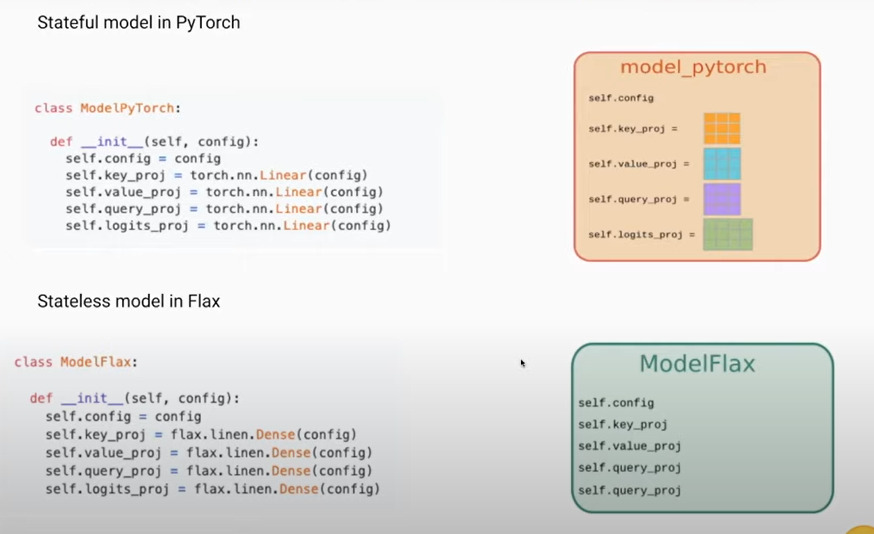
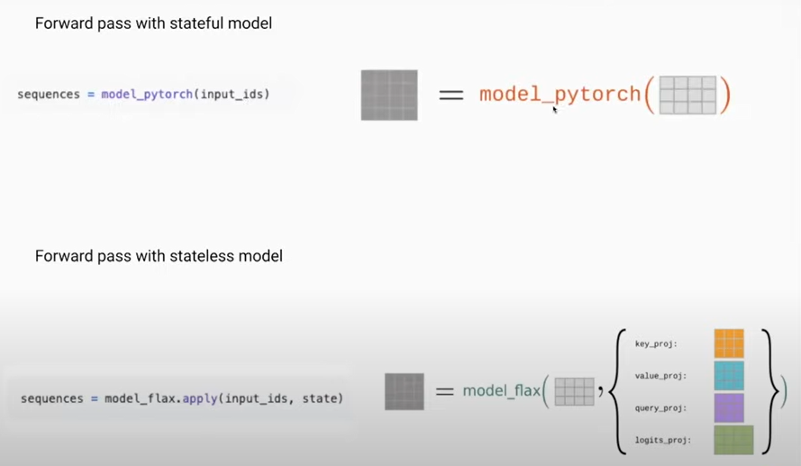
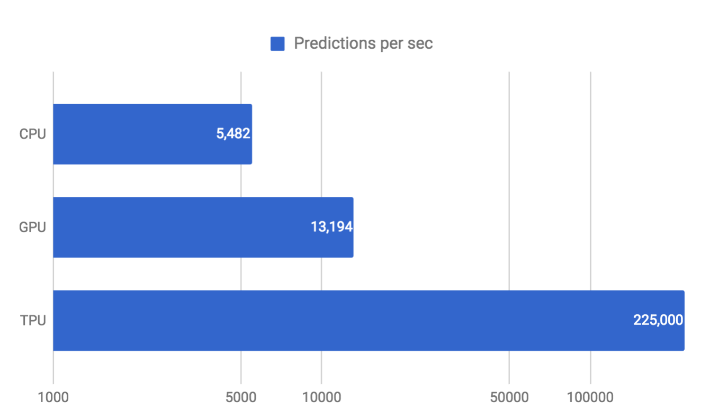
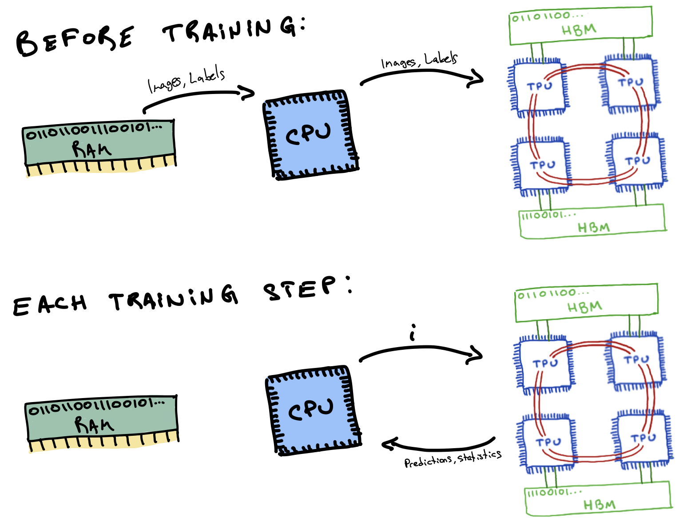

# NLP/NLU: Flax with Parallel Learnig on TPU

## Motivation
Natural Language Processing models, such as BERT, are state-of-the-art in AI. However, those models are slow when we train (including transfer learning) them with our datasets. There are many reasons for the cause being slow. One of the main reasons is that the model is expensive because we usually use a single GPU, regardless of the spec. Simply, to solve the problem, we train a model in parallel. However, Pytorch and TensorFlow are not capable of the parallel learning in deep learning, but Flax and Jax are. This project demonstrates how fast Flax and Jax can finish their training on TPU and how to implement them.

### 1.Requirements

Environments:
- Google Colab
- Python ==> 3.7+

Libraries:
- Flax
- Jax
- Optax
- Transformers
- Datasets

```shell
!pip install git+https://github.com/huggingface/transformers.git
!pip install flax
!pip install git+https://github.com/deepmind/optax.git
!pip install datasets
!pip install transformers
```

### 2.Datasets Explain

train.csv - Contains the annotated discourse elements for all essays in the test set.  
discourse_id - ID code for discourse element  
essay_id - ID code for essay response. This ID code corresponds to the name of the full-text file in the train/ folder.  
discourse_text - Text of discourse element.  
discourse_type - Class label of discourse element.  
discourse_type_num - Enumerated class label of discourse element.  
discourse_effectiveness - Quality rating of discourse element, the target. 

To predict the quality rating of each discourse element.<br>
Ineffective [0]  
Adequate [1]  
Effective [2]

*More details: [Here](https://www.kaggle.com/competitions/feedback-prize-effectiveness/overview)

### 3.Flax Aspects

#### Q: What is FLax?
Flax is a high-performance neural network library for JAX that is designed for flexibility. The primary distinction between Flax and Pytorch or TensorFlow is that Flax is stateless and Pytorch and TensorFlow are stateful. The left-below picture shows that Python can recongnize the model's weights when we initialize the object and store them inside of the module (class). Python, on the other hand, is unable to recognize the weight of the Flax model because Flax is dependent on Jax. Jax expects no side effects due to the pure functional basis. Then, the right-bottom picture shows that Python recongnize the details, such as weights, of the Flax model during the forward passing, and we also need to pass the model (state).<br>

<p align="center">

<br>
</p>

#### Q: What is TPU and Why TPU?
TPU is a specialized processing unit by Google that was built for two purposes. First, Google used it to help improve their own products such as image search, translation, AlphaGo and other services by providing better machine learning results. Second, they released this powerful hardware into the cloud so other people can use it to get better results in their machine learning tasks. [source](https://mygraphicscard.com/tpu-vs-gpu/)
<p align="center">

</p>
In comparison with the CPU, GPU, and TPU, the above picture proves that TPU is extremely quicker than others because TPU is designed for deep learning. On top of that, TPUs read their data from their High-Bandwidth Memory, or HBM, before training to maximize the model performance. During the training, the CPU orders to the TPU, "Please train on batch number i", for some i, since the TPU already has this batch stored in its HBM. We are able to see the TPU potential when we train with heavy models such as NLP. Thus, we use the TPU in this project.


### 4.Demo

### 5.Results

### 6.Future Study
